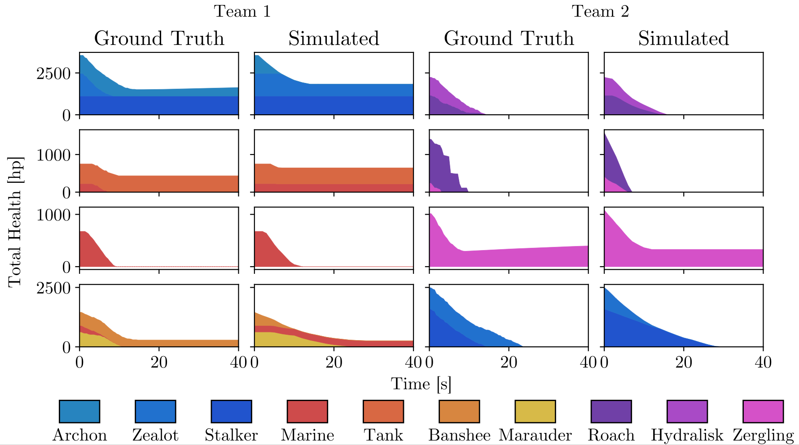

# libvoxelbot


This library contains several algorithms that are useful when building bots for Starcraft 2.

It contains a build order simulator, a build order optimizer, a combat simulator, influence maps, many useful predicates and unit data lookups.

## Combat Simulator

The combat simulator can simulate battles between units of all SC2 races.
It properly takes into account things like:

- Damage bonuses (e.g. Immortal bonus against armored units).
- Melee units take a longer time to reach the enemy.
- Not an infinite number of melee units can attack the same unit at the same time.
- Damage/armor bonuses due to upgrades.
- A few special cased upgrades like: Resonating Glaives, Charge, Extended Thermal Lance..
- Healing units like Medivacs and Shield Batteries as well as some shielding units like the Sentry.
- Melee units typically block enemy melee units from attacking the ranged units further back.
- The range of units is properly taken into account when the engagement starts. For example siege tanks can start to attack much earlier than roaches as tanks have a much higher range.
- Splash damage is approximated ok-ish.
- It assumes that units do decent target firing.

It does *not* take the following effects into account:

- Terrain effects like choke points and low/high ground.
- Unit positions. Many effects that relate to unit positions are approximated, but the exact values are not used.
- Bunkers and other cases where units can be inside another unit.
- Kiting.
- More advanced abilities like Psi Storm and many others.

The simulator is pretty fast. It can simulate on the order of tens of thousands of battles per second. The performance does of course depend on the number of units in the fight and how long the fight continues for.

The image below shows 4 battles as simulated in the combat simulator and the ground truth when running in Starcraft 2.



### Simple example
```C++
initMappings();
CombatPredictor simulator;
simulator.init();
CombatState state = {{
    makeUnit(1, UNIT_TYPEID::TERRAN_MARINE),
    makeUnit(1, UNIT_TYPEID::TERRAN_MEDIVAC),
    makeUnit(1, UNIT_TYPEID::TERRAN_MARINE),

    makeUnit(2, UNIT_TYPEID::ZERG_ROACH),
    makeUnit(2, UNIT_TYPEID::ZERG_ROACH),
    makeUnit(2, UNIT_TYPEID::ZERG_ZERGLING),
}};
CombatResult outcome = simulator.predict_engage(state);
cout << outcome.state.toString() << endl;
cout << "Winner player is " << outcome.state.owner_with_best_outcome() << endl;
```
[Show full source code](examples/combat_simulator.cpp)

Output:

```
Owner Unit       Health
1     Marine       0/45
1     Medivac    150/150
1     Marine       0/45
2     Roach       58/145
2     Roach      145/145
2     Zergling     0/35

Winner player is 2
```

### More advanced example

This shows how upgrades can be specified and how to access the unit data in the outcome.

<details><summary>Show code</summary>

```C++
initMappings();
CombatPredictor simulator;
simulator.init();

CombatState state = {{
    makeUnit(1, UNIT_TYPEID::TERRAN_MARINE),
    makeUnit(1, UNIT_TYPEID::TERRAN_MEDIVAC),
    makeUnit(1, UNIT_TYPEID::TERRAN_MARINE),

    makeUnit(2, UNIT_TYPEID::ZERG_ROACH),
    makeUnit(2, UNIT_TYPEID::ZERG_ROACH),
    makeUnit(2, UNIT_TYPEID::ZERG_ZERGLING),
}};

CombatUpgrades player1upgrades = {
    UPGRADE_ID::TERRANINFANTRYWEAPONSLEVEL1,
    UPGRADE_ID::TERRANINFANTRYWEAPONSLEVEL2,
    UPGRADE_ID::TERRANINFANTRYWEAPONSLEVEL3,
    UPGRADE_ID::TERRANINFANTRYARMORSLEVEL1,
    UPGRADE_ID::TERRANINFANTRYARMORSLEVEL2,
};

CombatUpgrades player2upgrades = {
    UPGRADE_ID::ZERGMISSILEWEAPONSLEVEL1,
};

state.environment = &simulator.getCombatEnvironment(player1upgrades, player2upgrades);

CombatSettings settings;
// Simulate for at most 100 *game* seconds
// Just to show that it can be configured, in this case 100 game seconds is more than enough for the battle to finish.
settings.maxTime = 100;
CombatResult outcome = simulator.predict_engage(state, settings);
cout << outcome.state.toString() << endl;
for (auto& unit : outcome.state.units) {
    cout << getUnitData(unit.type).name << " ended up with " << unit.health << " hp" << endl;
}
cout << "Winner player is " << outcome.state.owner_with_best_outcome() << endl;
cout << "Battle concluded after " << outcome.time << " seconds" << endl;
```

[Show full source code](examples/combat_simulator2.cpp)

</details>

Output:
```
Owner Unit       Health
1     Marine      45/45
1     Medivac    150/150
1     Marine       0/45
2     Roach        0/145
2     Roach        0/145
2     Zergling     0/35

Marine ended up with 45 hp
Medivac ended up with 150 hp
Marine ended up with 0 hp
Roach ended up with 0 hp
Roach ended up with 0 hp
Zergling ended up with 0 hp
Winner player is 1
Battle concluded after 33 seconds
```

## Build Order Optimizer

The build order optimizer can find a highly optimized build order for producing a given set of units.

- It can automatically build additional Nexuses/Hatcheries/Command Centers, workers and even Warpgate research if that speeds up the build order.
- It has support for chrono boost.
- It works for any built-in race, however Protoss is the one most heavily tested. Zerg and Terran may require some additional work.
- Takes on the order of half a second to run. The number of iterations can be lowered/increased to adjust the quality/time trade-off.
- Does not optimize for the absolutely shortest build order by default, but optimizes for a good economy as well.
- Can take both units and upgrades as requirements.
  
### Simple example

This example shows how to generate a build order from a given starting state.

```C++
initMappings();

// Start with 1 nexus and 12 probes
BuildState state {{
    { UNIT_TYPEID::PROTOSS_NEXUS, 1 },
    { UNIT_TYPEID::PROTOSS_PROBE, 12 },
}};
// Start with 50 minerals
state.resources.minerals = 50;
state.resources.vespene = 0;
// Our Nexus has 50 energy at the start of the game
state.chronoInfo.addNexusWithEnergy(state.time, 50);

// Find a good build order for producing some units
BuildOrder buildOrder = findBestBuildOrderGenetic(state, {
    { BuildOrderItem(UNIT_TYPEID::PROTOSS_ZEALOT), 4 },
    { BuildOrderItem(UNIT_TYPEID::PROTOSS_STALKER), 4 },
    { BuildOrderItem(UNIT_TYPEID::PROTOSS_IMMORTAL), 2 },
    { BuildOrderItem(UPGRADE_ID::PROTOSSGROUNDARMORSLEVEL1), 1 },
});

// Print the build order
cout << buildOrder.toString() << endl;

// Print a more detailed build order output which includes timing information
cout << buildOrder.toString(state, BuildOrderPrintMode::Detailed);
```
[Show full source code](examples/build_optimizer.cpp)

<details><summary>Show example output</summary>

```
  0 PROTOSS_PROBE
  1 PROTOSS_PROBE
  2 PROTOSS_PYLON
  3 PROTOSS_PROBE
  4 PROTOSS_PROBE
  5 PROTOSS_GATEWAY
  6 PROTOSS_PROBE
  7 PROTOSS_PROBE
  8 PROTOSS_ASSIMILATOR
  9 PROTOSS_PROBE
 10 PROTOSS_FORGE
 11 PROTOSS_PROBE
 12 PROTOSS_PROBE
 13 PROTOSS_ASSIMILATOR
 14 PROTOSS_PROBE
 15 PROTOSS_GATEWAY
 16 PROTOSS_CYBERNETICSCORE
 17 PROTOSS_PROBE
 18 PROTOSS_PYLON
 19 PROTOSS_STALKER
 20 PROTOSS_ROBOTICSFACILITY
 21 PROTOSS_ZEALOT
 22 PROTOSSGROUNDARMORSLEVEL1
 23 PROTOSS_PYLON
 24 PROTOSS_ZEALOT
 25 PROTOSS_ZEALOT
 26 PROTOSS_IMMORTAL
 27 PROTOSS_STALKER
 28 PROTOSS_STALKER
 29 PROTOSS_PYLON
 30 PROTOSS_STALKER
 31 PROTOSS_IMMORTAL
 32 PROTOSS_ZEALOT

    Time Food  Min. Ves. Name
  0 0:00 13/15    0    0 PROTOSS_PROBE (chrono boosted)
  1 0:08 14/15   40    0 PROTOSS_PROBE
  2 0:12 14/15    0    0 PROTOSS_PYLON
  3 0:17 15/15    0    0 PROTOSS_PROBE
  4 0:30 16/23  127    0 PROTOSS_PROBE
  5 0:32 16/23    0    0 PROTOSS_GATEWAY
  6 0:38 17/23   34    0 PROTOSS_PROBE
  7 0:47 18/23  105    0 PROTOSS_PROBE
  8 0:47 18/23   30    0 PROTOSS_ASSIMILATOR
  9 0:57 19/23  135    0 PROTOSS_PROBE
 10 0:58 19/23    0    0 PROTOSS_FORGE
 11 1:09 20/23  124    2 PROTOSS_PROBE (chrono boosted)
 12 1:17 21/23  195   24 PROTOSS_PROBE
 13 1:17 21/23  120   24 PROTOSS_ASSIMILATOR
 14 1:25 22/23  192   45 PROTOSS_PROBE
 15 1:25 22/23   42   45 PROTOSS_GATEWAY
 16 1:32 22/23    0   64 PROTOSS_CYBERNETICSCORE
 17 1:35 23/23    1   72 PROTOSS_PROBE
 18 1:42 23/23    0   98 PROTOSS_PYLON
 19 2:08 25/31  268  186 PROTOSS_STALKER
 20 2:08 25/31  118   86 PROTOSS_ROBOTICSFACILITY
 21 2:12 27/31   74  107 PROTOSS_ZEALOT
 22 2:13 27/31    0   16 PROTOSSGROUNDARMORSLEVEL1
 23 2:20 27/31    0   50 PROTOSS_PYLON
 24 2:38 29/39  175  146 PROTOSS_ZEALOT
 25 2:39 31/39   90  151 PROTOSS_ZEALOT
 26 2:54 35/39   54  133 PROTOSS_IMMORTAL
 27 3:05 37/39   94  140 PROTOSS_STALKER
 28 3:07 39/39    0  101 PROTOSS_STALKER
 29 3:13 39/39    0  135 PROTOSS_PYLON
 30 3:35 41/47  205  200 PROTOSS_STALKER
 31 3:39 45/47    0  124 PROTOSS_IMMORTAL (chrono boosted)
 32 3:46 47/47    0  159 PROTOSS_ZEALOT (chrono boosted)
Done at 4:09
```
</details>

If you have a SC2 observation instance you can construct a BuildState easily. It would be annoying to have to manually add everything.
This takes care of things like finding existing buildings, units and upgrades as well as buildings and units that are in progress.
It will also estimate the remaining number of mineral fields around each base.

```C++
// If you have a SC2 agent observation you can construct a build state easily
BuildResources resources(observation->GetMinerals(), observation->GetVespene());
float time = ticksToSeconds(observation->GetGameLoop());
BuildState state(observation, Unit::Alliance::Self, Race::Protoss, resources, time));
```

## Using the precompiled library

Requirements:
- C++14
- [s2client-api](https://github.com/Blizzard/s2client-api)

Steps
- Download the precompiled library (see [latest release](https://github.com/HalfVoxel/sc2-libvoxelbot/releases/latest)).
- Unzip the compressed folder. Inside there are two folders: include and lib.
- Add the include directory to your project's list of include directories.
- Add either the release or debug library in the lib folder to your project's linker settings.
  In Visual Studio this is done in the Project Properties -> Linker -> Input -> Additional Dependencies setting.
  In CMake you use the `target_link_libraries` command.

After you have done this you should be good to go. Assuming your project already uses the s2client-api library and links against it.

## Building

Requirements:
- C++14

```bash
git clone --recursive <this repository>
cd sc2-libvoxelbot
mkdir build
cd build
cmake ..

# The above will generate project files for you.
# Which type depends on which platform you are using.
# On Windows it will for example generate a Visual Studio project which you can then build.
# On linux/mac you can now write
make -j8 
# to build the library (the -j8 parameter makes it use a multithreaded build, so it goes faster)
```

When everything is built you can execute one of the tests

```bash
# Unix/Mac
./build/bin/example_combat_simulator

# Windows
./build/Release/example_combat_simulator.exe
```
